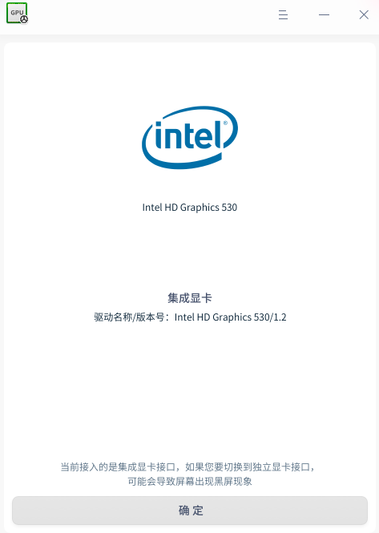
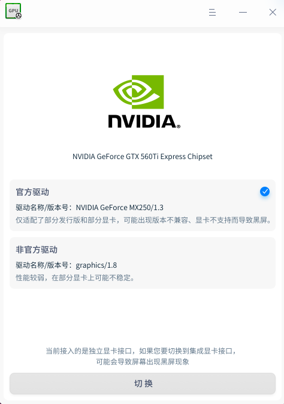
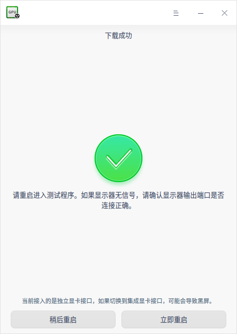
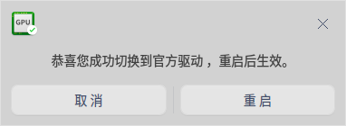
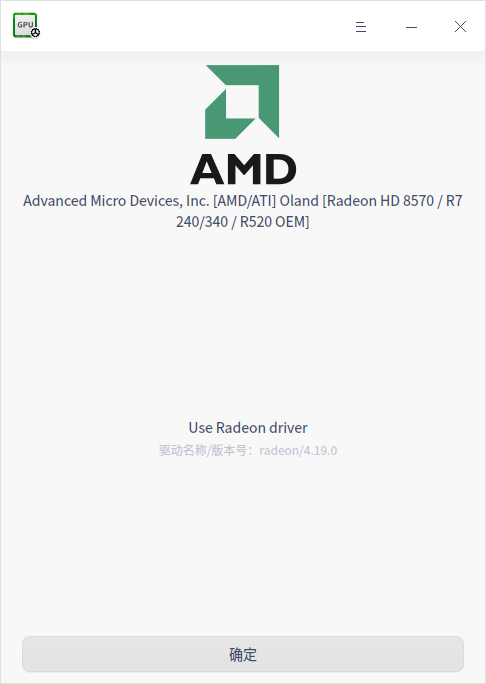

# 显卡驱动管理器|../common/graphics_driver_manager_96.svg|

## 概述

显卡驱动管理器是一款小巧、简单易用的显卡驱动管理工具，包括显卡驱动的安装、切换、还原等功能。

## 使用入门

通过以下方式运行或关闭显卡驱动管理器，或者创建显卡驱动管理器的快捷方式。

### 运行显卡驱动管理器

1. 单击任务栏上的启动器 ，进入启动器界面。
2. 上下滚动鼠标滚轮浏览或通过搜索，找到显卡驱动管理器 ，单击运行。
3. 右键单击  ，您可以：

 - 单击 **发送到桌面**，在桌面创建快捷方式。
 - 单击 **发送到任务栏**，将应用程序固定到任务栏。
 - 单击 **开机自动启动**，将应用程序添加到开机启动项，在电脑开机时自动运行该应用。

### 关闭显卡驱动管理器

- 在显卡驱动管理器界面，单击  ，退出显卡驱动管理器。
- 在任务栏右键单击 ，选择 **关闭所有** 来退出显卡驱动管理器。
- 在显卡驱动管理器界面，单击  ，选择 **退出** 来退出显卡驱动管理器。

## 操作介绍

### 台式电脑

#### Intel显卡

如果台式电脑接入的是Intel显卡，显卡驱动管理器界面只显示Intel显卡的驱动名称和版本号。

#### Nvidia显卡

如果台式电脑接入的是Nvidia显卡，则会有两种驱动模式，分别官方驱动和非官方驱动。

- 官方驱动：属于闭源驱动，性能比较好，但是部分显卡会出现兼容性问题，导致屏幕出现黑屏。
- 非官方驱动：属于开源驱动，性能较弱，在部分显卡上可能不稳定。

您可以参考以下步骤切换驱动。

1. 在显卡驱动管理器界面上，选择一个新的显卡驱动方案，单击 **切换**。

   

2. 驱动方案下载成功后，单击 **立即重启**，新驱动将在重启后自动完成安装。

   

3. 观看测试动画检测新驱动的显示效果。

4. 单击 **应用** 完成驱动方案切换，或单击 **取消** 还原到切换之前的驱动方案。

5. 电脑将会自动重启，切换或还原操作将在重启后生效。

   

#### AMD显卡

如果台式电脑接入的是AMD显卡，显卡驱动管理器界面会显示AMD显卡信息，包括驱动名称、版本号等。

### 笔记本电脑

#### Intel显卡

Intel显卡笔记本电脑中，显卡驱动管理器界面只显示Intel显卡的驱动名称和版本号。

#### Nvidia+Intel 双显卡

双显卡笔记本电脑会有三种驱动模式，分别为集成显卡、节能模式和性能模式。

- 集显驱动：安装系统时自带的驱动方案，与节能模式、性能模式进行切换使用。

- 节能模式：能节省电脑资源，提升使用续航，也称为大黄蜂方案。选中节能模式，单击 **确定** 按钮后自动进入切换页面下载驱动，采用的是官方驱动；

- 性能模式：能提升系统运行性能，也称为Prime方案。选中性能模式，单击 **确定** 按钮自动进入切换页面下载驱动，采用的是官方驱动；

您可以参考以下步骤切换驱动。
1. 在显卡驱动管理器界面上，选择一个新的显卡驱动方案，单击 **切换**。

   

2. 驱动方案切换成功后，单击 **立即重启**，新驱动将在重启后自动完成安装。

3. 观看测试动画检测新驱动的显示效果。

4. 单击 **应用** 完成驱动方案切换，或单击 **取消** 还原到切换之前的驱动方案。

5. 电脑将会自动重启，切换或还原操作将在重启后生效。

## 主菜单

### 主题
窗口主题包含浅色主题、深色主题和系统主题。

1. 在显卡驱动管理器界面，单击 。
2. 单击 **主题**，选择一个主题颜色。

### 帮助

1. 在显卡驱动管理器界面，单击 。
2. 单击 **帮助**，查看帮助手册，进一步了解和使用显卡驱动管理器。

### 关于

1. 在显卡驱动管理器界面，单击 。
2. 单击 **关于**，查看显卡驱动管理器的版本和介绍。

### 退出

1. 在显卡驱动管理器界面，单击 。
2. 单击 **退出**。

