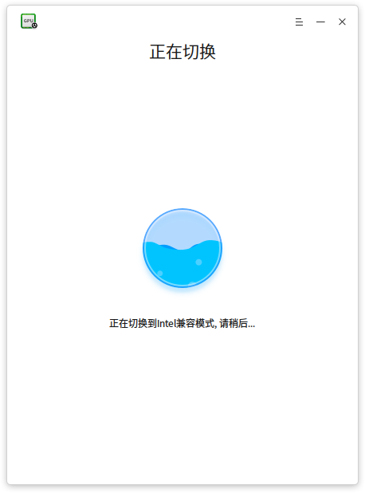
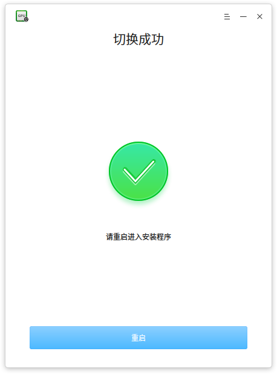
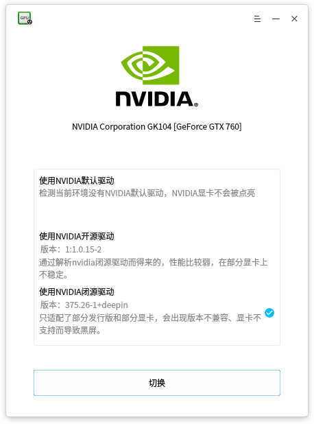
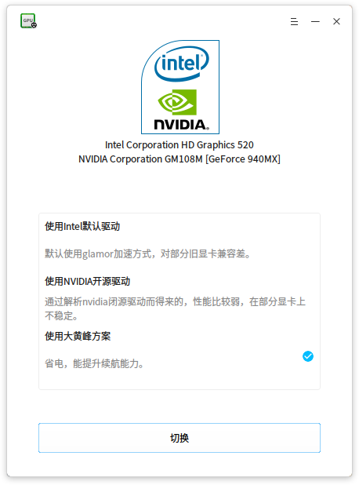
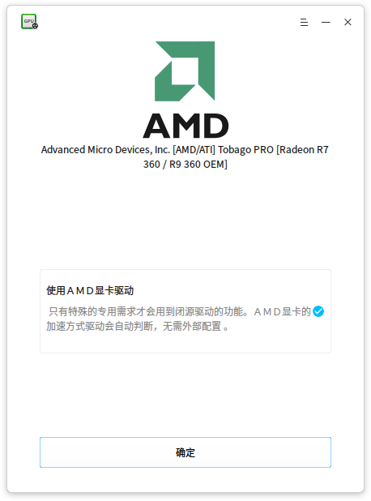
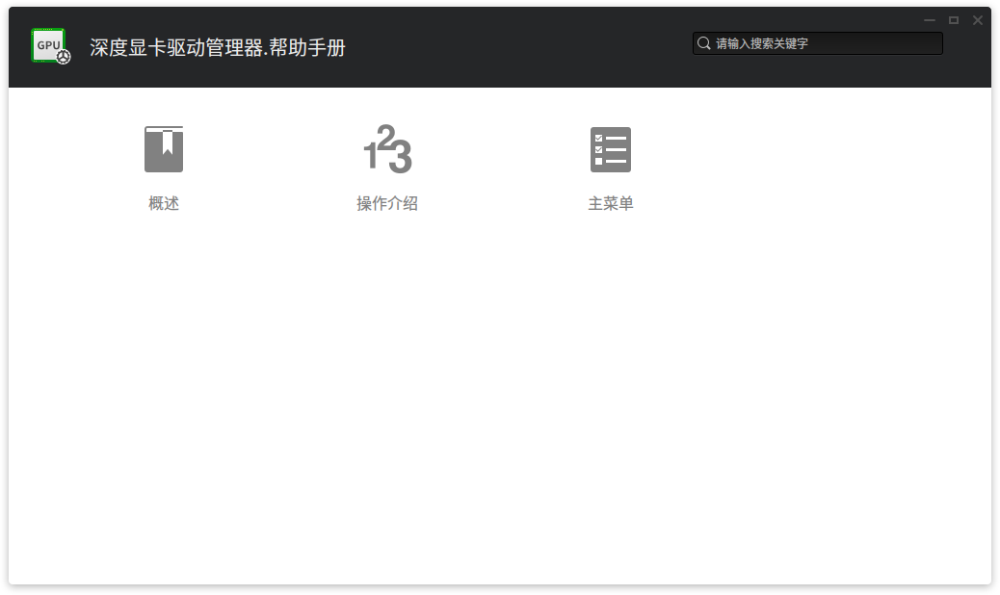

# 深度显卡驱动管理器|../common/deepin-graphics-driver-manager.svg|

## 概述|../common/icon_overview.svg|

深度显卡驱动管理器是一款小巧、简单易用的显卡驱动管理工具，包括了显卡驱动问题探测、显卡驱动方案安装、切换、还原等功能。

## 操作介绍|../common/icon_commoncoperat.svg|

深度显卡驱动管理器支持还原操作，不用担心把系统玩坏。新驱动安装失败会自动还原到之前的驱动，即使新驱动安装后黑屏，按电源键重启也可以还原到之前的驱动。

> :如果您选择的是当前正在使用的驱动方案，界面上会显示 **确定** 按钮，如果您不想切换其他显卡驱动方案，可以点击 **确定** 或  直接退出深度显卡驱动管理器。

### Nvidia显卡驱动管理

#### Nvidia 单显卡

Nvidia显卡推荐闭源驱动，性能比较好，但是部分显卡会出现兼容性问题。如果闭源驱动无法使用，您可以尝试使用开源驱动。默认安装的驱动一般是安装系统时自带的驱动方案，主要考虑兼容性，性能一般。

1. 在深度显卡驱动管理器界面上，选择一个新的显卡驱动方案。
2. 点击 **切换**。
3. 驱动方案切换成功后，点击 **重启**，新驱动将在重启后自动完成安装。
4. 观看测试动画检测新驱动的显示效果。
5. 点击 **应用** 完成驱动方案切换，或点击 **取消** 还原到原来的驱动方案。
6. 电脑将会自动重启，切换或还原操作将在重启后生效。

#### Nvidia+Intel 双显卡（台式机）

双显卡推荐使用Nvidia独显，和Nvidia单显卡一样支持闭源驱动和开源驱动。如果闭源驱动和开源驱动都无法使用，您可以尝试使用Intel集显默认驱动。

1. 在深度显卡驱动管理器界面上，选择一个新的显卡驱动方案。
2. 点击 **切换**。
3. 驱动方案切换成功后，点击 **重启**，新驱动将在重启后自动完成安装。
4. 观看测试动画检测新驱动的显示效果。
5. 点击 **应用** 完成驱动方案切换，或点击 **取消** 还原到原来的驱动方案。
6. 电脑将会自动重启，切换或还原操作将在重启后生效。

#### Nvidia+Intel 双显卡（笔记本）

双显卡笔记本推荐使用大黄蜂方案（需硬件支持），系统默认使用Intel集显，大型程序可以自行调用Nvidia独显。如果大黄蜂方案无法使用，您可以尝试使用Nvidia开源驱动或使用Intel集显默认驱动。

> :如果检测到您的笔记本不支持大黄蜂方案，界面上就没有大黄蜂选项，你可以参考[Nvidia+Intel 双显卡（台式机）](Nvidia+Intel 双显卡（台式机）)进行选择。

1. 在深度显卡驱动管理器界面上，选择一个新的显卡驱动方案。
2. 点击 **切换**。
3. 驱动方案切换成功后，点击 **重启**，新驱动将在重启后自动完成安装。
4. 观看测试动画检测新驱动的显示效果。
5. 点击 **应用** 完成驱动方案切换，或点击 **取消** 还原到原来的驱动方案。
6. 电脑将会自动重启，切换或还原操作将在重启后生效。

### Intel显卡驱动管理

Intel显卡推荐使用默认驱动，性能比较好，但对部分旧显卡兼容性差。如果默认驱动无法使用，你可以尝试使用加速模式。兼容模式是Intel显卡比较古老的驱动方案，主要考虑兼容性，性能比较弱。

1. 在深度显卡驱动管理器界面上，选择一个新的显卡驱动方案。
2. 点击 **切换**。
3. 驱动方案切换成功后，点击 **重启**，新驱动将在重启后自动完成安装。
4. 观看测试动画检测新驱动的显示效果。
5. 点击 **应用** 完成驱动方案切换，或点击 **取消** 还原到原来的驱动方案。
6. 电脑将会自动重启，切换或还原操作将在重启后生效。

### AMD显卡驱动管理

AMD显卡使用官方开源驱动是最佳的驱动方案，目前没有其他选择方案，您可以在查看显卡型号之后退出深度显卡驱动管理器。

## 主菜单|../common/icon_optionsetting.svg|

### 帮助

您可以点击帮助获取深度显卡驱动管理器的帮助手册，通过帮助进一步让您了解和使用深度显卡驱动管理器。

1. 在深度显卡驱动管理器界面，点击 。
2. 点击 **帮助**。
3. 查看关于深度显卡驱动管理器的帮助手册。

### 关于

您可以点击关于查看深度显卡驱动管理器的版本介绍。

1. 在深度显卡驱动管理器界面，点击 。
2. 点击 **关于**。
3. 查看关于深度显卡驱动管理器的版本和介绍。

### 退出

您可以进入菜单栏点击退出深度显卡驱动管理器。

1. 在深度显卡驱动管理器界面，点击 。
2. 点击 **退出**。

